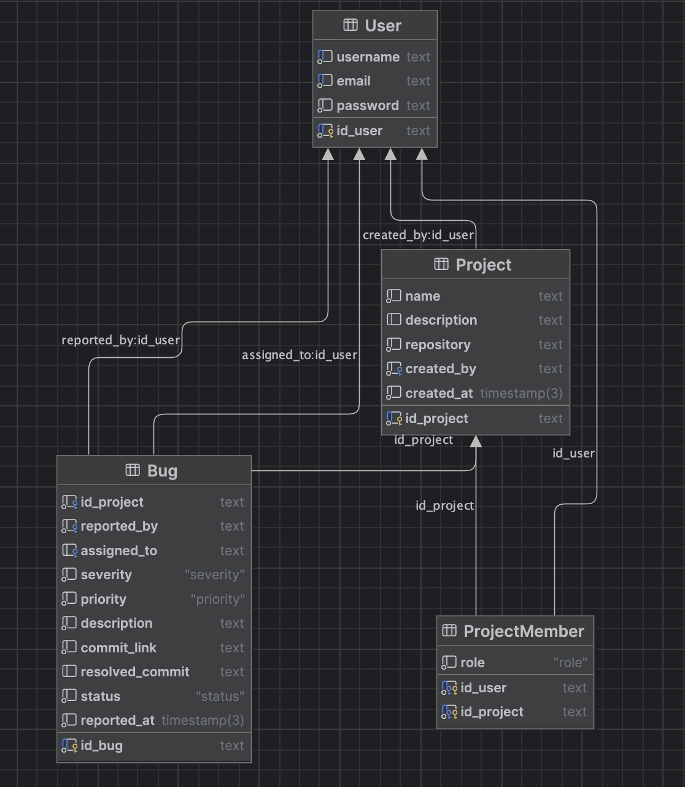

# 🐞 Bug Tracking Platform (EN)

This project was created by   Covrig Eduard-Gabriel and  Constantin Arthur-Stefan,  as part of the **Web Technologies** course at the Faculty of Cybernetics, Statistics and Economic Informatics (ASE Bucharest).

---

## 📘 Documentation Links
- For backend run instructions: **[Click here](back/readme.md)**
- For frontend run instructions: **NOT YET IMPLEMENTED**

---

## 🛠️ Technologies Used
- **Backend:** Node.js, Express.js, JWT with bcrypt for authentication  
- **Database:** PostgreSQL, Prisma ORM  
- **Frontend:** React.js  

👉 **See SQL Tables Documentation:** [Database information](database/database_models.md)

---

## 📁 Project Structure

The project is organized into **two main folders**:

- **back**  → REST API & Database  
- **front** → User Interface  

---

## 📝 Project Plan

1. Requirements analysis  
2. General project structure setup  
3. CRUD RESTful API development (backend implementation)  
4. User interface development  
   - HTML implementation  
   - CSS styling  
5. Backend–frontend connection  
6. Testing and bug fixing  
7. Adding final code comments  
8. Project presentation  

---

## 🔧 Platform Functionalities

Any user can access the site under two main roles:

- **MP** (member of a software project)  
- **TST** (tester: a user who is not part of any project but tests existing projects)

### 👤 If a user logs in as a **member without a project**:
They can browse the **Search Projects** section and join a project as a **Tester**.

As a tester, the user can report bugs through the **Bug Tracking** section, providing:

1. a description of the issue  
2. the commit where the bug appears  
3. the severity level  

### 👨‍💻 For project members:
They can view all reported bugs and mark them as *resolved* from the **Bug Tracking** section on the project page.

This ensures **efficient communication between the team and testers**, enabling faster debugging and better project workflow.

---
---

# 🐞 Platforma de Bug Tracking (RO)

Acest proiect a fost realizat de Covrig Eduard-Gabriel si Constantin Arthur-Stefan, in cadrul cursului de **Tehnologii Web** la Facultatea de Cibernetica, Statistica si Informatica Economica (ASE Bucuresti).

---

## 📘 Link-uri Documentatie
- Pentru instructiuni de rulare backend: **[Click aici](back/readme.md)**
- Pentru instructiuni de rulare frontend: **INCA NEIMPLEMENTAT**

---

## 🛠️ Tehnologii folosite
- **Backend:** Node.js, Express.js, JWT pentru autentificare  
- **Baza de date:** PostgreSQL, Prisma ORM  
- **Frontend:** React.js  

👉 **Vezi documentatia tabelelor SQL:** [Informatii despre baza de date](database/database_models.md)

---

## 📁 Structura Proiectului

Proiectul este organizat in **doua foldere principale**:

- **back**  → REST API si baza de date  
- **front** → Interfata utilizator  
---

## 📝 Plan Proiect

1. Analiza cerintelor  
2. Stabilirea structurii generale a proiectului  
3. Dezvoltarea CRUD RESTful API (implementare backend)  
4. Dezvoltarea interfetei utilizator  
   - Implementare HTML  
   - Stilizare CSS  
5. Conectarea backend–frontend  
6. Testare si corectarea bug-urilor  
7. Adaugarea comentariilor finale in cod  
8. Prezentarea proiectului  

---

## 🔧 Functionalitati Platforma

Orice utilizator poate accesa site-ul cu doua roluri principale:

- **MP** (membru al unui proiect software)  
- **TST** (tester: utilizator care nu face parte din niciun proiect si testeaza proiectele existente)

### 👤 Daca un utilizator se conecteaza ca **membru fara proiect**:
Acesta poate naviga in sectiunea **Search Projects** si se poate alatura unui proiect ca **Tester**.

In calitate de tester, utilizatorul poate raporta bug-uri in sectiunea **Bug Tracking**, furnizand:

1. descrierea problemei  
2. commit-ul in care apare bug-ul  
3. nivelul de severitate  

### 👨‍💻 Pentru membrii proiectului:
Acestia pot vizualiza toate bug-urile raportate si le pot marca ca *rezolvate* in sectiunea **Bug Tracking** a paginii proiectului.

Aceasta asigura **o comunicare eficienta intre echipa si testeri**, facilitand rezolvarea rapida a problemelor si un flux de lucru mai eficient.